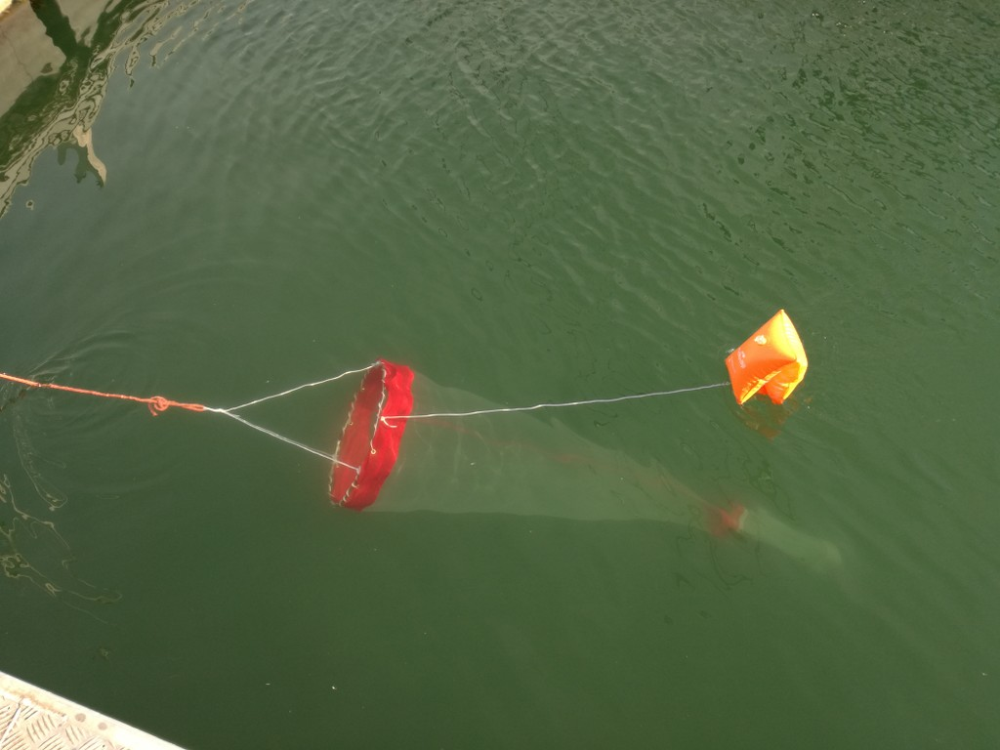

# Module 3 : Assemblage

## **Étape 15 : Perçage et fixation des œillets**

Sur la partie haute du filet, percer des trous de 12mm de diamètre -soit le diamètre intérieur des œillets à poser), à 15 centimètres d'intervalle, à l'aide d'un fer à souder. Positionner puis frapper les œillets au niveau des trous.

## **Étape 16 :  Fixation de l'arceau sur le filet**

Enfiler la drisse de 4mm de diamètre à l'intérieur de chaque œillets. Enrouler la drisse autour de l'arceau 2 à 3 fois entre chaque œillet afin de maintenir le filet contre l'arceau.

## **Étape 17 : Fixation du flotteur et du poids sur l'arceau**

Attacher 1m de drisse à une extrémité de l'arceau puis au poids de 1kg avec un nœud de chaise.

Attacher 1m de drisse à l'autre extrémité de l'arceau puis au brassard avec un nœud de chaise.&#x20;

Attacher 3x 1m de drisse à l'arceau avec des nœuds de chaise sur un anneau Ø 8mm afin de faciliter la fixation du filet à l'arrière du voilier.

## **Étape 18 : Assemblage du filet avec le collecteur**

Enfiler la partie base du filet sur le manchon du collecteur jusqu'au niveau des grenouillères. Fixer solidement le filet au manchon avec un collier de serrage.

<figure><figcaption></figcaption></figure>
